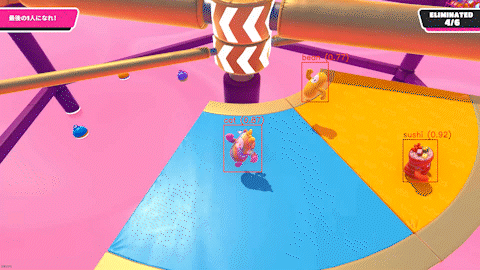

# このリポジトリについて
Python コードと Jupyter Notebook にて、Azure Custom Vision を使って物体検知モデルを作成して、動画を分析して分析結果を動画として出力するコードです。各コードは以下のことを行います。

- create_acv_account.sh
  - Azure リソースグループの作成
  - Azure Custom Vision アカウントの作成
  - 作成した Azure Custom Vision アカウントのエンドポイントとキーを取得してファイルに出力 (acv_config.json)
- create_model_by_acv.ipynb
  - Azure Custom Vision プロジェクトの作成
  - プロジェクトへの画像のアップロードとタグの追加
  - プロジェクトでのトレーニングの開始
  - トレーニングにより作成された分析モデル(ONNX)のダウンロード
  - トレーニングにより作成された分析モデル(ONNX)の使用
- extract_frames_from_video.py
  - 動画ファイルから各フレームを画像ファイルとして出力

> アノテーションファイルは [VoTT](https://github.com/microsoft/VoTT) で出力されたアノテーション結果を想定しています。

# 使い方

以下のコマンドを実行して、前準備を行います。

```bash
# Anaconda で Python 仮想環境を作成する
conda env create

# Azure Custom Vision アカウントを作成する
./create_acv_account.sh rg-acv-sample2 acv-sample2

# ビデオファイルから各フレームの画像ファイルを作成する
python extract_frames_from_video.py sample_video.mp4 images
```

ノートブック ```create_model_by_acv.ipynb``` を作成した Python 仮想環境 ```env_acv_sample``` のカーネルにて実行します。

# 分析結果として出力される動画

